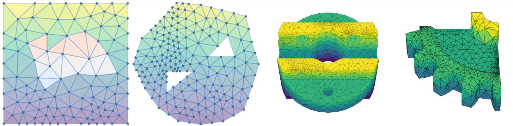

# (NeurIPS2025 $\textcolor{blue}{SPOTLIGHT}$) Higher-Order-Differential-Topology-aware-GNN 
The code of the proposed model DEC-HOGNN on the benchmark 2D-electrostatics is offered, as shown in Table 2 in our paper.  The code doesn't need any extra dependency except for popular libraries like `pytorch`,`numpy` and some python standard libraries. 

### Instructions
Class `HOGNNDataset` in `datagen2D.py` has encapsulated all stuff that DEC-HOGNN requires (like adjacencies, volumes, boundary markers, whitney elements etc). The training, validation and test datasets have been already partitioned in ./data. The training code lies in `main.py` and some auxilary classes are in `basics.py`. 

## Datasets

The datasets mentioned in the paper are offered here, which are generated by Ansys Maxwell. Some key attributes in the 2D datasets are depicted here. The 3D ones are likewise:
- `pedge_vol,pface_vol,vedge_vol,vface_vol`: the volume (edge length, face area) of the primal / dual elements. Nodes volume are directly set 1. 
- `edge_tangents, dual_edge_tangents`: the unit vector indicating the edge direction
- `edge_whitney_vec, dedge_whitney_vec`: the whitney element of each edge $w_i\nabla\mathbf{w}_j-w_j\nabla\mathbf{w}_i$， where $\mathbf w_i$ is the canonical hat function in FEM(finite element method)
- `is_bdry_node, is_bdry_edge, is_bdry_face`: the binary boundary mask
- `node_node_upper_idx, edge_edge_lower_idx, edge_edge_upper_idx, face_face_lower_idx,edge_node_idx,face_edge_idx`: various adjacencies mentioned in our paper
- `edge_idx, face_idx, vedge_idx`: the index of the elements
- `p_x, d_x, p_y, d_y`: `p/d` indicates primal / dual grpahs; `x` is the input (masked fields) while `y` is the output. The `p_x` in `2Dele` dataset has 5-dim attributes: the intensity, displacement and charge density $\mathbf E, \mathbf D, \rho$ while it is the intensity ,flux and current density $\mathbf H, \amthbf B, j$ in magnetic datasets.

### Quick Start
A trained model within 500 epochs is provided. You can load the parameters and run the test function by simply typing in the command:

`python main.py --gpu=0 --mode=1`

You can also choose to train the model by: 

` python main.py --gpu=0 --mode=0`

You can cite our paper by (.bibtex): 
```
@inproceedings{
liao2025boundaryvalue,
title={Boundary-Value {PDE}s Meet Higher-Order Differential Topology-aware {GNN}s},
author={Yunfeng Liao and Yangxin Wu and Xiucheng Li},
booktitle={The Thirty-ninth Annual Conference on Neural Information Processing Systems},
year={2025},
url={https://openreview.net/forum?id=PluDA8DEar}
}
```